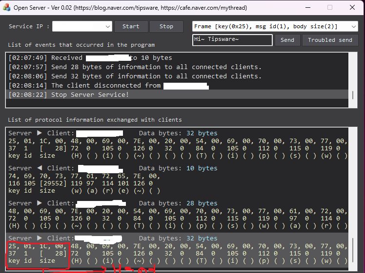
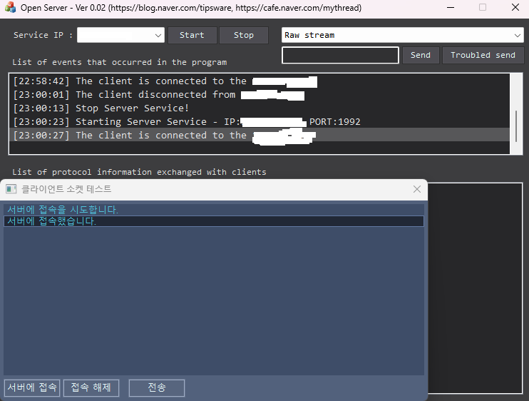
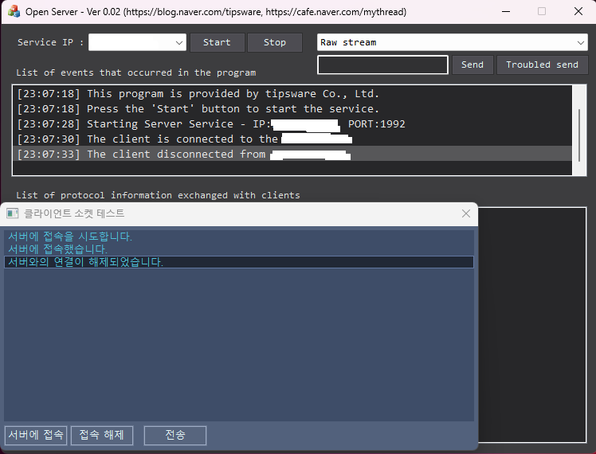
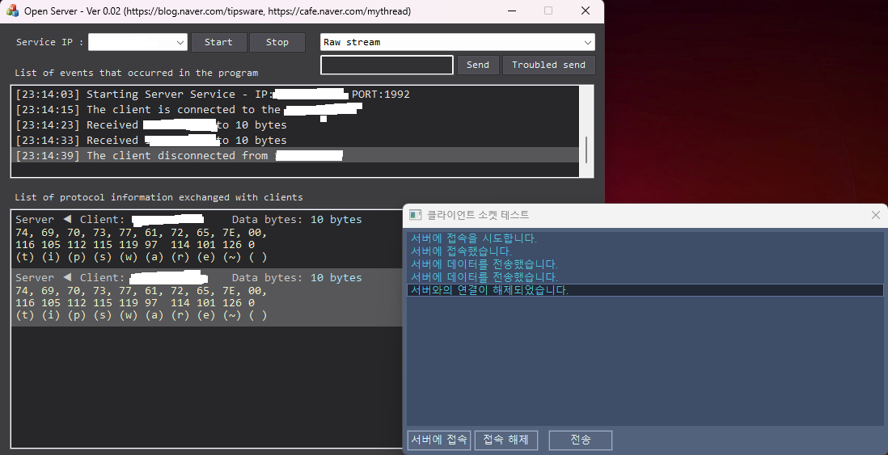
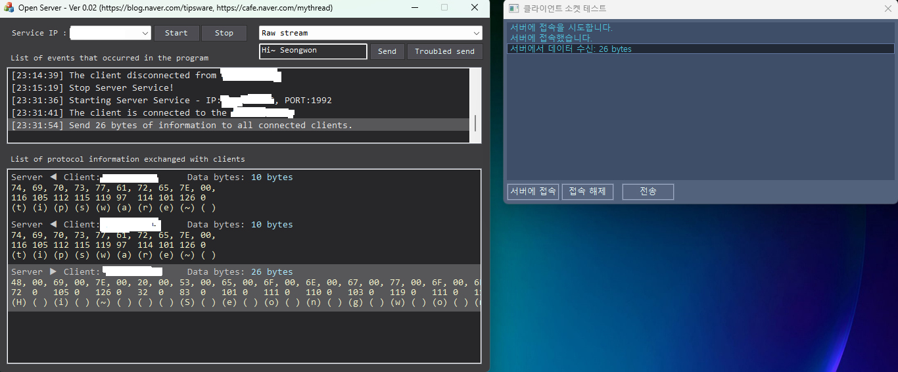
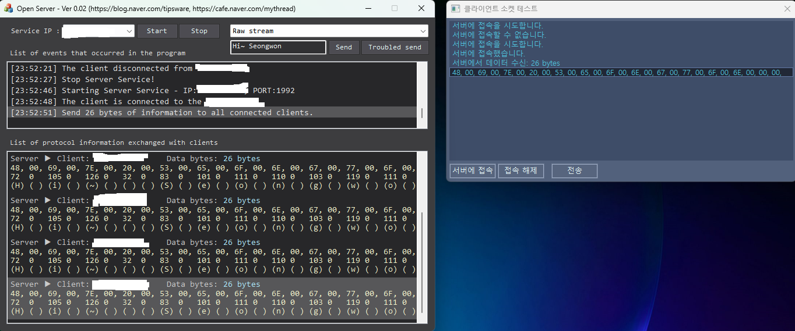
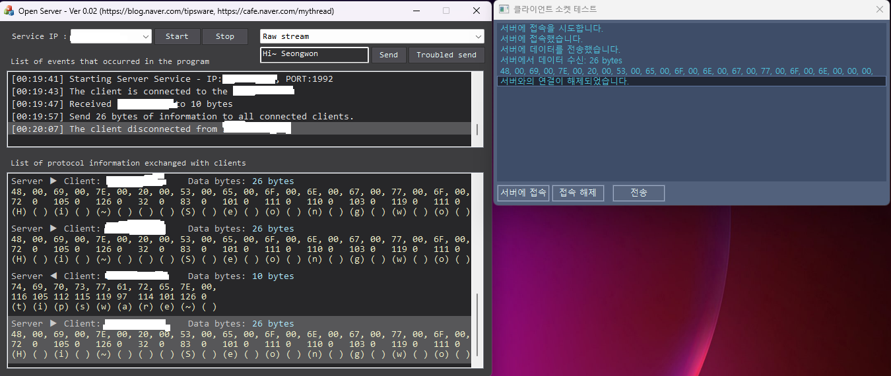
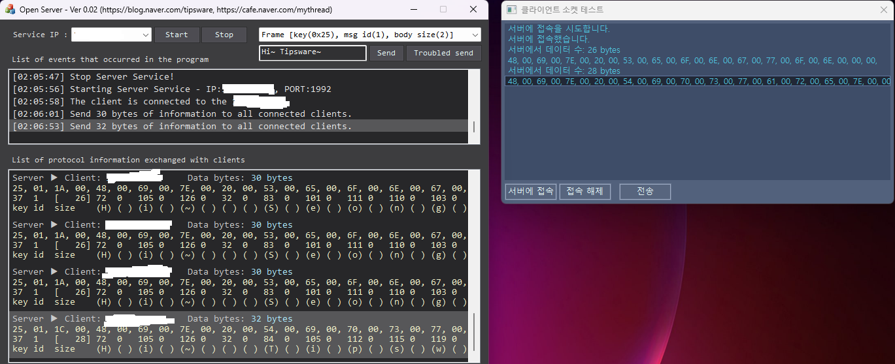
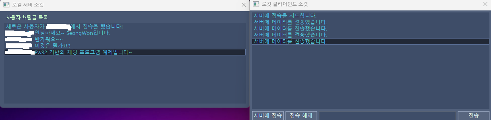

# EasyWin32 
## WinApi(구: Win32API)를 C언어로 가볍게 익힐 수 있는 프레임 워크

## 학습 기간
> 24.3.1 ~ 24.3.15(계속 복습 중)

## 사용 언어
 
 

## 진행한 챕터
### 1. 기본 요소 - 도형 그리기, 좌표 이용, 펜,채우기 등의 윈도우 속성 연습

### 2. 마우스 이벤트 사용 - 마우스 키 이벤트 발생 시 사용되는 함수, 매크로 함수 익히기

### 3. 컨트롤 객체 사용하기 - 버튼, 에디트, 리스트 박스 사용법, 컨트롤 호출 함수 익히기

 

## 왜 이것을 공부하는 가?
- C언어의 실습 결과물은 항상 까만 콘솔 화면에 출력해서 보아야 했음
- C++의 WinAPI는 GUI 화면을 제공하기에 보다 다채로운 결과물을 출력할 수 있음 -> C언어를 사용해서 나타낼 수도 있지 않을까 라는 생각을 하게 됨
- 공부하는 카페 매니저님과 우연한 만남으로 이 EasyWin32 카페를 추천받아 공부함
- 클라이언트 윈도우 화면 내에서 발생하고 있는 이벤트 및 속성 등을 하나 하나씩 익힐 수 있기에 공부하게 되었음
- c언어의 고급 문법(포인터, 구조체, 연결 리스트 등)이 어떻게 적용될 수 있는 지 코드를 쳐보면서 익힐 수 있음

 
